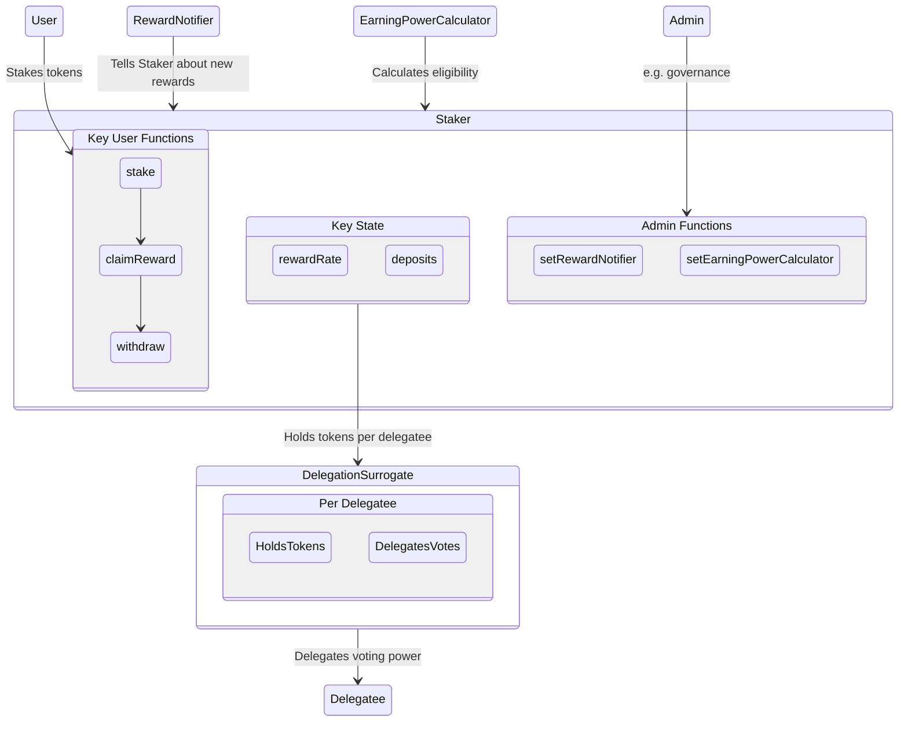
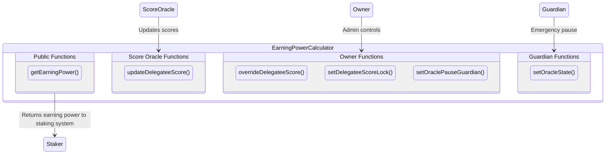

# Staker

Staker is a flexible, configurable staking contract. Staker makes it easy to distribute onchain staking rewards for any ERC20 token, including DAO governance tokens.

## How it works:

### 1. Deploy and configure a Staker
- Staker is deployed with a single staking token.
- Staker is deployed with an admin, such as a DAO.
- Staker is configured to collect and distribute reward tokens.

### 2. Tokenholders stake
- Tokenholders of the staking token can deposit those tokens in Staker.
- There is no delay to deposit or withdraw.
- If the staking token is a governance token, depositors can delegate their staked tokens' voting power to themselves or someone else.
- The depositor sets a claimer who can claim the staking rewards, such as themselves or someone else.

### 3. Staker distributes rewards
- The admin sends rewards into Staker.
- Optionally, the admin sets eligibility criteria for rewards.
- Staker distributes those rewards over time.
- Each tokenholder's reward is proportional to their staked balance over time.
- Claimers can claim their accrued rewards at any time.

When Staker is used for a protocol or DAO, the rewards are generally funded by protocol revenue and/or issuance of the native token from the treasury.

## Implementation details:

Staker can be deployed as an immutable contract with minimal governance. It does have some admin functions:

- Adding a new source of rewards.
- Changing the eligibility oracle or the emergency pause guardian.
- Overriding eligibility for a particular address.

The staking token can be an `ERC20` token, including `ERC20Votes` governance tokens. Staker splits up all voting power in Staker by creating a surrogate contract for each delegate.

Staker distributes rewards over a fixed period of time. This minimizes discontinuities from flash staking, and prevents frontrunning attacks, aimed at gaining a disproportionate share of rewards, ahead of reward distributions.

### Staking system

The staking system accepts user stake, delegates their voting power, and distributes rewards for eligible stakers.



### Earning Power Calculator

The earning power calculator determines which depositors are eligible for rewards—and the rate at which those rewards are earned—based on their stake and their governance delegatee. The calculator is a modular component of the staker, which can be customized and updated by owner of the Staker, such as a DAO. One provided implementation uses an oracle. An oracle is needed because eligibility depends on the off-chain behavior of DAO delegates.



## Usage

The Staker repository is designed to be used as a library. Once added to your project, it can be used to assemble, configure, and deploy an instance of Staker appropriate for your project.

### Installation

#### Foundry

Add Staker as a dependency:

```bash
forge install withtally/staker
```

#### Hardhat

Staker is not currently distributed as a package on npm, but it can still be added to a HardHat project by referencing the github repository directly.

Add the following lines to to your `package.json` in the `dependencies` key:

```json
"dependencies": {
    "@openzeppelin/contracts": "^5.0.2",
    "staker": "github:withtally/staker#v1.0.1"
  }
```

Note that because the `staker` package is pinned to a version branch on GitHub. To upgrade to a new version of Staker in the future, you cannot expect an upgrade to a new version simply by running `npm upgrade`. Instead, you will have to update the tag referenced in the `pacakage.json` and re-run `npm install`.

### Quick-Start via StakerFactory

Starting with v1.1.0 the repository ships a `StakerFactory` contract that lets you deploy an **entire** staking system (base contract + extensions) in **one transaction**.

```solidity
// Pseudo-script (Foundry)
StakerFactory factory = new StakerFactory();
address staker = factory.createStakingSystem(
  address(rewardToken),   // ERC20 distributed as rewards
  address(stakeToken),    // ERC20Votes / ERC20Permit governance token being staked
  address(calc),          // IEarningPowerCalculator implementation
  0,                      // initial maxBumpTip
  admin                   // admin address
);
```

The returned `staker` address is an instance of `FullStaker`, which bundles:
• `StakerDelegateSurrogateVotes`
• `StakerPermitAndStake`
• `StakerOnBehalf`

If you need a different set of extensions you can still follow the manual approach described in the next section.

### Import and Assemble a Staker

To create a concrete implementation, import Staker and the desired extensions. Create a new contract that inherits from Staker and the extensions of choice, and implement the constructor, along with any method overrides in accordance with your desired set of features and customizations.

For example, here is a concrete implementation of the Staker that:

* Uses an [ERC20Votes](https://docs.openzeppelin.com/contracts/5.x/api/token/erc20#ERC20Votes) style governance token as its staking token (via the `StakerDelegateSurrogateVotes` extension)
* Uses a staking token that includes permit functionality, and provides convenience staking methods that use this functionality (via the `StakerPermitAndStake` extension)
* Allows users to take actions via EIP712 signatures (via the `StakerOnBehalf` extension)
* Allows a maximum claim fee of 1 (18 decimal) reward token, but configures the Staker with claim fees turned off to start

```solidity
pragma solidity 0.8.28;

import {Staker} staker/Staker.sol;
import {StakerDelegateSurrogateVotes} from "staker/extensions/StakerDelegateSurrogateVotes.sol";
import {StakerPermitAndStake} from "staker/extensions/StakerPermitAndStake.sol";
import {StakerOnBehalf} from "staker/extensions/StakerOnBehalf.sol";

contract MyStaker is
  Staker,
  StakerDelegateSurrogateVotes,
  StakerPermitAndStake
  StakerOnBehalf
{
  constructor(
    IERC20 _rewardsToken,
    IERC20Staking _stakeToken,
    IEarningPowerCalculator _earningPowerCalculator,
    uint256 _maxBumpTip,
    address _admin
  )
    Staker(_rewardsToken, _stakeToken, _earningPowerCalculator, _maxBumpTip, _admin)
    StakerPermitAndStake(_stakeToken)
    StakerDelegateSurrogateVotes(_stakeToken)
    EIP712("MyStaker", "1")
  {
    // Override the maximum reward token fee for claiming rewards
    MAX_CLAIM_FEE = 1e18;
    // At deployment, there should be no reward claiming fee
    _setClaimFeeParameters(ClaimFeeParameters({feeAmount: 0, feeCollector: address(0)}));
  }
}
```

### Testing

Foundry users can also import test-related contracts into their own tests if desired:

```solidity
pragma solidity 0.8.28;

import {StakerTestBase} from "staker-test/StakerTestBase.sol";

contract MyStakerTest is StakerTestBase {
    // ... Your test implementations
}
```

Hardhat users cannot, by definition, import test contracts into their own tests. Any testing infrastructure for JavaScript tests must be written by the downstream consumer of the Staker package.

## Development

These contracts were built and tested with care by the team at [ScopeLift](https://scopelift.co).

### Build and test

This project uses [Foundry](https://github.com/foundry-rs/foundry). Follow [these instructions](https://github.com/foundry-rs/foundry#installation) to install it.

Clone the repo.

Set up your .env file

```bash
cp .env.template .env
# edit the .env to fill in values
```

Install dependencies & run tests.

```bash
forge install
forge build
forge test
```

### Spec and lint

This project uses [scopelint](https://github.com/ScopeLift/scopelint) for linting and spec generation. Follow [these instructions](https://github.com/ScopeLift/scopelint?tab=readme-ov-file#installation) to install it.

To use scopelint's linting functionality, run:

```bash
scopelint check # check formatting
scopelint fmt # apply formatting changes
```

To use scopelint's spec generation functionality, run:

```bash
scopelint spec
```

This command will use the names of the contract's unit tests to generate a human readable spec. It will list each contract, its constituent functions, and the human readable description of functionality each unit test aims to assert.

## License

The code in this repository is licensed under the [GNU Affero General Public License](LICENSE) unless otherwise indicated.

Copyright (C) 2025 Tally
