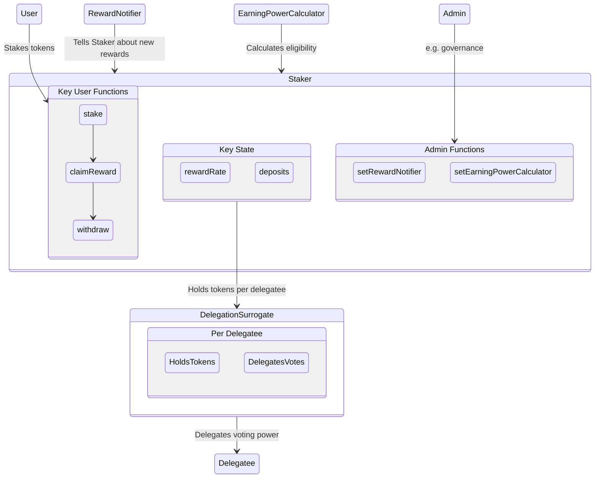
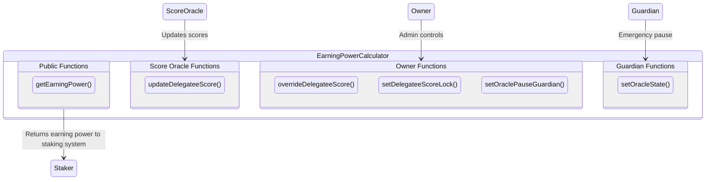

# Staker

Staker is a flexible, configurable staking contract. Staker makes it easy to distribute onchain staking rewards for any ERC20 token.

## How it works:

### 1. Deploy and configure a Staker
- Staker is deployed with a single staking token
- Staker is deployed with an admin, such as a DAO.
- Staker is configured to distribute one or more reward tokens

### 2. Tokenholders stake
- Tokenholders of the staking token can deposit those tokens in Staker.
- There is no delay to deposit or withdraw.
- If the staking token is a governance token, depositors can delegate their staked tokens' voting power to themselves or someone else
- The depositor sets a claimer who can claim the staking rewards, such as themselves or someone else.

### 3. Staker distributes rewards
- The admin sends rewards into Staker.
- Optionally, the admin sets eligibility criteria for rewards.
- Staker distributes those rewards over time.
- Each tokenholder's reward is proportional to their staked balance over time.
- Claimers can claim their accrued rewards at any time.

When Staker is used for a protocol or DAO, the rewards are generally funded by protocol revenue and/or issuance of the native token from the treasury.

## Implementation details:

Staker can be deployed as an immutable contract with minimal governance. It does have some admin functions:

- Adding a new source of rewards
- Changing the eligibility oracle or the emergency pause guardian
- Overriding eligibility for a particular address

The staking token can be an `ERC20` token, including `ERC20Votes` governance tokens. Staker splits up all voting power in Staker by creating a surrogate contract for each delegate.

Staker distributes rewards over a fixed period of time. That gives everyone a chance to stake and minimizes discontinuities from flash staking.

### Staking system

The staking system accepts user stake, delegates their voting power, and distributes rewards for eligibile stakers.



### Earning Power Calculator

The earning power calculator determines which stakers are eligible for a reward. This implementation uses an oracle. An oracle is needed because eligibility depends on off-chain behavior.



## Development

These contracts were built and tested with care by the team at [ScopeLift](https://scopelift.co).

### Build and test

This project uses [Foundry](https://github.com/foundry-rs/foundry). Follow [these instructions](https://github.com/foundry-rs/foundry#installation) to install it.

Clone the repo.

Set up your .env file

```bash
cp .env.template .env
# edit the .env to fill in values
```

Install dependencies & run tests.

```bash
forge install
forge build
forge test
```

### Spec and lint

This project uses [scopelint](https://github.com/ScopeLift/scopelint) for linting and spec generation. Follow [these instructions](https://github.com/ScopeLift/scopelint?tab=readme-ov-file#installation) to install it.

To use scopelint's linting functionality, run:

```bash
scopelint check # check formatting
scopelint fmt # apply formatting changes
```

To use scopelint's spec generation functionality, run:

```bash
scopelint spec
```

This command will use the names of the contract's unit tests to generate a human readable spec. It will list each contract, its constituent functions, and the human readable description of functionality each unit test aims to assert.

## License

The code in this repository is licensed under the [GNU Affero General Public License](LICENSE) unless otherwise indicated.

Copyright (C) 2024 Tally
