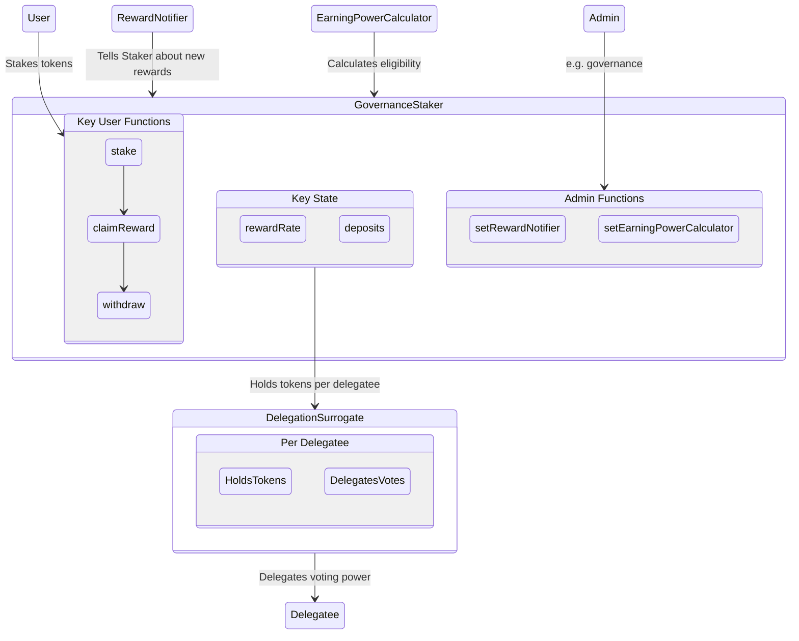
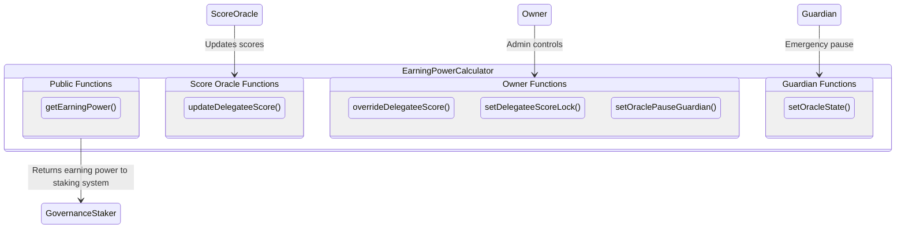

# Governance Staking

Governance Staking rewards a DAO's tokenholders for participating in governance. This staking system distributes rewards to tokenholders whose tokens are active in governance. Rewards generally come from the DAO, funded by protocol revenue and/or issuance of the native token from the treasury.

## How it works:
- The DAO decides how stakers can be eligible for rewards. The DAO sets up an oracle to put eligiblity scores onchain.
- Tokenholders stake their tokens. There is no delay to stake or unstake. Stakers set a beneficiary for their reward, such as themselves.
- The DAO sends rewards into its Governance Staking.
- Governance Staking distributes the rewards over time. Each staker's reward is proportional to their staked balance over time.
- Beneficiaries can claim their accrued rewards at any time.

## Implementation details:
Governance Staking can be deployed as an immutable contract with minimal governance. It does have some admin functions:
- Adding a new source of rewards
- Changing the eligibility oracle or the emergency pause guardian
- Overriding eligibility for a particular address

Staking is compatible with existing `ERC20Votes` governance tokens. It splits voting power by creating a surrogate contract for each delegate.

Governance Staking distributes rewards over a fixed period of time. That gives everyone a chance to stake and minimizes discontinuities from flash staking.

### Governance Staking system

The governance staking system accepts user stake, delegates their voting power, and distributes rewards for eligibile stakers.



### Earning Power Calculator

The earning power calculator determines which stakers are eligible for a reward. This implementation uses an oracle. An oracle is needed because eligibility depends on off-chain behavior.



## Development

These contracts were built and tested with care by the team at [ScopeLift](https://scopelift.co).

### Build and test

This project uses [Foundry](https://github.com/foundry-rs/foundry). Follow [these instructions](https://github.com/foundry-rs/foundry#installation) to install it.

Clone the repo.

Set up your .env file

```bash
cp .env.template .env
# edit the .env to fill in values
```

Install dependencies & run tests.

```bash
forge install
forge build
forge test
```

### Spec and lint

This project uses [scopelint](https://github.com/ScopeLift/scopelint) for linting and spec generation. Follow [these instructions](https://github.com/ScopeLift/scopelint?tab=readme-ov-file#installation) to install it.

To use scopelint's linting functionality, run:

```bash
scopelint check # check formatting
scopelint fmt # apply formatting changes
```

To use scopelint's spec generation functionality, run:

```bash
scopelint spec
```

This command will use the names of the contract's unit tests to generate a human readable spec. It will list each contract, its constituent functions, and the human readable description of functionality each unit test aims to assert.


## License

The code in this repository is licensed under the [GNU Affero General Public License](LICENSE) unless otherwise indicated.

Copyright (C) 2024 Tally
